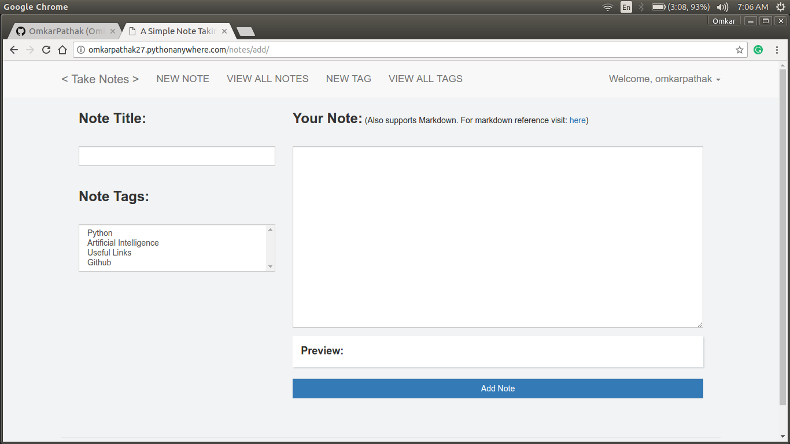
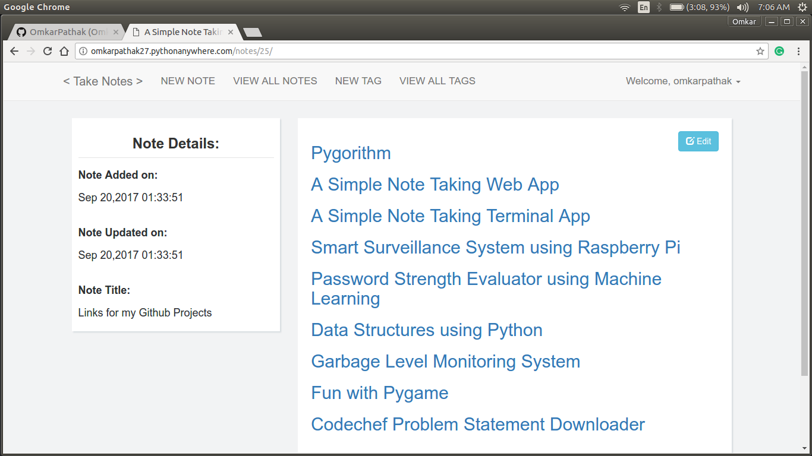
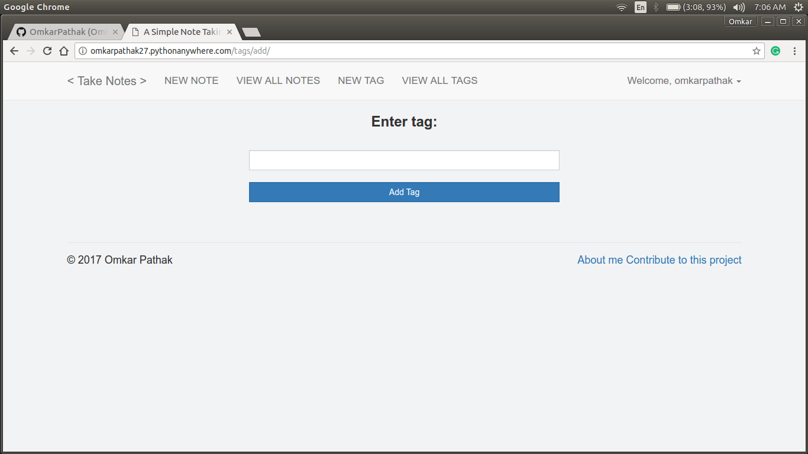
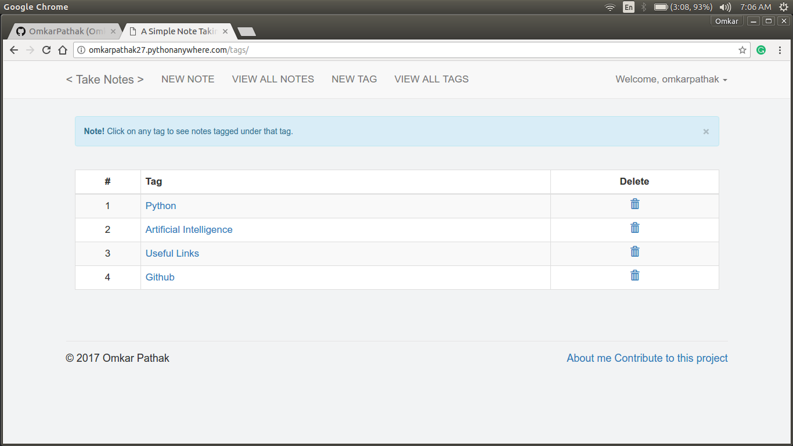
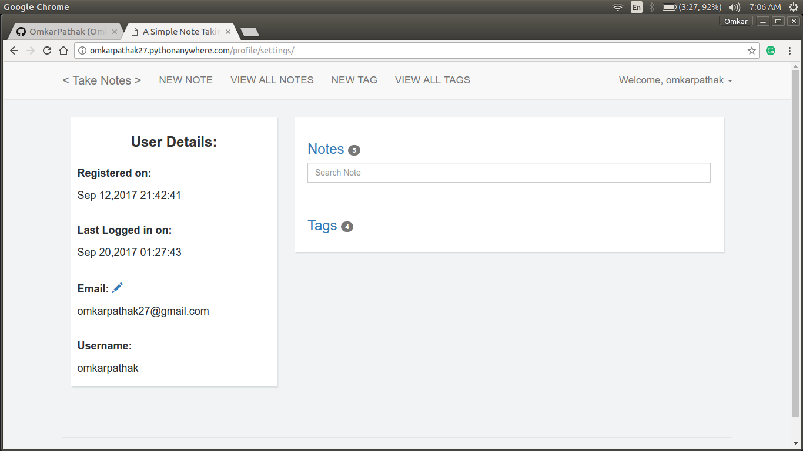

# A-Simple-Note-Taking-Web-App
An easy to use and deploy web app built using Flask

Wanna try this app? Visit: [http://omkarpathak27.pythonanywhere.com/](http://omkarpathak27.pythonanywhere.com/)

# Features:

* Simple Web application, easy to use and *very* easy to deploy locally
* Written in simple Python. Even a beginner Python developer can contribute to this
* Support for SQLite, so you can easily play with it
* REST API for retrieving data easily

# Requirements:

Execute the following command to install the required third party libraries: 

`pip3 install -r requirements.txt`

# Usage:
Clone this repository:

`git clone https://github.com/OmkarPathak/A-Simple-Note-Taking-Web-App.git`

Install the dependencies by simply executing:

`pip3 install -r requirements.txt`

Run this command to start the app:

`python3 manage.py`

Visit `0.0.0.0:5000` on your web browser

Happy Noting :)

Built with ♥ by [`Omkar Pathak`](http://www.omkarpathak.in/)

# Results

## Creating a new note
Simple innterface with live preview and markdown support

## Viewing a note
Edit box provided to simply edit the note

## Adding a tag

## Viewing all tags
You can click on any tag to see all notes tagged under *that* tag

## Profile Settings
Profile settings to see user details, change email and see notes and tags saved by particular user

# Donation

If you have found my softwares to be of any use to you, do consider helping me pay my internet bills. This would encourage me to create many such softwares :)

| PayPal |  |
|:-------------------------------------------:|:-------------------------------------------------------------:|
| ₹ (INR)  |  |
